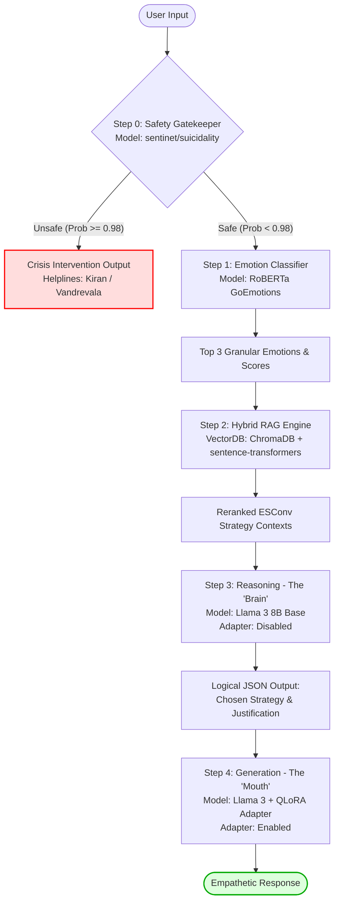

# Project Empathy API v3.0

[](https://fastapi.tiangolo.com)
[](https://pytorch.org)
[](https://huggingface.co)
[](https://meta.ai)
[](https://github.com/artidoro/qlora)

Project Empathy v3.0 is a highly specialized, state-of-the-art **Agentic Clinical Empathy Pipeline** exposed as a FastAPI orchestrator. 

Unlike standard conversational AIs that act as "helpful assistants" by immediately jumping to bulleted task lists or unsolicited advice when a user expresses distress, Project Empathy replicates clinical counseling frameworks. It employs a multi-agentic **"Two-Brain" architecture** that prioritizes cognitive empathy (emotion classification), affective validation (therapist-grounded strategy selection), and professional counseling styles using a fine-tuned **QLoRA** model.

---

## 🌟 Key Technical Highlights

- **The "Two-Brain" System (Adapter Isolation):** Eliminates *Task Interference* by decoupling reasoning from speech. 
  - **The Brain (Logical Reasoning):** Employs the base `Llama-3-8B-Instruct` with the fine-tuned adapter **disabled** and low temperature (`0.2`) to output flawless JSON strategy decisions.
  - **The Mouth (Empathetic Speech):** Leverages the same `Llama-3-8B-Instruct` model with a fine-tuned **QLoRA adapter enabled** (trained on verified expert therapist interactions) to speak with a warm, natural, and non-cliché empathetic tone.
- **Hybrid Cosine-Weighted RAG:** Dynamically queries a local `ChromaDB` containing the **ESConv (Emotional Support Conversation)** dataset. It constructs parallel queries for the top-3 identified emotions, enforces hard metadata filters, and performs max-pooling reranking using the formula:
  $$\text{Weighted Score} = (1.0 - \text{Cosine Distance}) \times \text{Emotion Probability}$$
- **Multi-Stage Safety Gatekeeper:** Incorporates a high-precision `sentinet/suicidality` classifier (fine-tuned **MentalBERT**) on CPU to inspect user text for crisis markers, immediately aborting the pipeline and providing clinical helpline details if crisis probability exceeds `98%`.
- **Compute Optimization (4-bit NF4):** Fully quantized with **bitsandbytes** (NF4 with double quantization and CPU offloading) to fit the entire pipeline inside a single consumer GPU (<12GB VRAM), making it ideal for standard Google Colab environments.

---

## 🏗️ Pipeline Architecture

The platform processes input through 5 sequential agentic stages:



---

## ⚙️ Detailed Pipeline Breakdown

### 🛡️ Step 0: Safety Gatekeeper
*   **Purpose:** Act as an immediate firewall protecting users in mental health crises.
*   **Model:** `sentinet/suicidality` (A Sequence Classification architecture built on top of pre-trained **MentalBERT**).
*   **Trigger:** If the crisis probability score is $\ge 0.98$, the pipeline is aborted, and a warm, supportive crisis response with official clinical helplines (Kiran & Vandrevala Foundation) is returned.
*   **Hardware:** Runs entirely on CPU to reserve GPU VRAM for generation tasks.

### 🎭 Step 1: Emotion Classifier
*   **Purpose:** Perform granular emotional analysis to power cognitive empathy.
*   **Model:** `SamLowe/roberta-base-go_emotions` (fine-tuned on the GoEmotions dataset: 58k Reddit comments annotated across 28 emotional labels).
*   **Output:** Returns Top-3 emotions and their sigmoid probabilities. Sigmoid allows independent probability evaluations, accurately capturing mixed emotional states.

### 🔍 Step 2: Contextual Retrieval (Hybrid RAG)
*   **Purpose:** Ground the model's strategies in real-world professional psychological interactions.
*   **Database:** `ChromaDB` (HNSW Cosine Space) loaded with the **ESConv (Emotional Support Conversation)** dataset.
*   **Embedder:** `sentence-transformers/all-MiniLM-L6-v2` (384-dimensional dense vectors).
*   **Mechanism:** Translates GoEmotions labels into ESConv’s 11-category taxonomy, queries the corresponding vector clusters, extracts historical counselor-client interactions, and performs confidence-based max-pooling reranking.

### 🧠 Step 3: Reasoning (The "Brain")
*   **Purpose:** Logically assess the emotional context and select a target counseling strategy.
*   **Model:** Base `meta-llama/Meta-Llama-3-8B-Instruct` (with the QLoRA adapter explicitly **disabled** to avoid task-interference).
*   **Output:** A strict, logical JSON containing: `emotional_analysis`, `user_situation_summary`, `chosen_strategy` (e.g., *Reflective Listening*, *Validation*, *Providing Suggestions*), and a `justification` for why that strategy is correct.

### 🗣️ Step 4: Generation (The "Mouth")
*   **Purpose:** Articulate the selected strategy in a clinical, highly conversational, and warm tone.
*   **Model:** `meta-llama/Meta-Llama-3-8B-Instruct` + **QLoRA Adapter** (fine-tuned on the **Counsel-Chat** dataset).
*   **Rules Enforced:** 
  1. *Strategy Lock:* The model must strictly execute the selected strategy and is forbidden from giving tips or advice unless "Providing Suggestions" is selected.
  2. *Anti-Cliche:* Strictly bans robotic therapist clichés like `"It sounds like..."` or `"I hear that..."`.
  3. *Clean Layout:* No bullet points, markdown lists, or referral notices (you act as their therapist in the moment).

---

## 🚀 Getting Started

This repository supports both **Local Execution** (via FastAPI + dotenv) and **Google Colab Execution** (via pyngrok + Colab Secrets).

### 📋 Prerequisites
- Python 3.10+
- A CUDA-enabled GPU (Minimum 12GB VRAM recommended for local inference, otherwise use the Google Colab workflow)
- A Hugging Face account and User Access Token with access to `meta-llama/Meta-Llama-3-8B-Instruct`

---

## 💻 Local Development Setup

1. **Clone the Repository:**
   ```bash
   git clone https://github.com/MihirBindal/Empathetic-AI.git
   cd Empathetic-AI
   ```

2. **Set up a Virtual Environment & Install Dependencies:**
   ```bash
   python -m venv venv
   source venv/bin/activate  # On Windows: venv\Scripts\activate
   pip install -r requirements.txt
   ```

3. **Configure Environment Variables:**
   Copy the provided `.env.example` file to create your own private `.env` file:
   ```bash
   cp .env.example .env
   ```
   Open the `.env` file and populate it with your active tokens:
   ```env
   HF_TOKEN=your_real_hugging_face_token_here
   NGROK_TOKEN=your_real_ngrok_token_here
   ```
   *(Note: The `.env` file is explicitly ignored by Git, so your tokens will never be pushed to your repository)*

4. **Launch the Orchestrator:**
   ```bash
   uvicorn main:app --host 0.0.0.0 --port 8000
   ```

---

## ☁️ Google Colab Development Setup

If you do not have a powerful local GPU, you can run the backend API on Google Colab's free T4 GPU (approx. 15GB VRAM) and expose the ports to the internet using `pyngrok`.

1. Upload the project folder to your Google Drive under `/content/drive/MyDrive/project_empathy_api`.
2. Open your Colab Notebook and navigate to the **Secrets tab** (indicated by the 🔑 **Key** icon on the left sidebar).
3. Define the following two secrets and toggle **Notebook access** to **ON**:
   - `HF_TOKEN`: Your Hugging Face User Access Token.
   - `NGROK_TOKEN`: Your ngrok Authtoken.
4. Run the `runner` notebook to download the models, load your adapter, expose the API port using `pyngrok`, and start the FastAPI webserver.

---

## 🔌 API Documentation & Usage

Once the backend orchestrator is running, it exposes a single unified POST endpoint `/generate`.

### POST `/generate`

**Payload Parameters:**
- `user_text` (string, Required): The input text from the client.
- `history` (list of objects, Optional): A list of previous conversational exchanges with `role` ("user"/"assistant") and `content` properties to keep history context.
- `run_baseline_comparison` (boolean, Default: `true`): If enabled, generates a baseline response using standard Llama-3 (useful for debugging and benchmark evaluation).
- `enable_cot` (boolean, Default: `true`): Toggles the Two-Brain Reasoning Step on or off.

#### Sample Request (`curl`):
```bash
curl -X POST "http://localhost:8000/generate" \
     -H "Content-Type: application/json" \
     -d '{
       "user_text": "I feel so anxious. I failed my major exam and I do not know how I will face my parents.",
       "run_baseline_comparison": true,
       "enable_cot": true,
       "history": []
     }'
```

#### Sample API Response:
```json
{
  "status": "success",
  "metadata": {
    "detected_emotions": [
      { "label": "anxiety", "score": 0.892 },
      { "label": "disappointment", "score": 0.741 },
      { "label": "fear", "score": 0.652 }
    ],
    "strategy_selected": "Validation",
    "strategy_justification": "The user feels anxiety and disappointment over academic failure and fear of parental reaction, which warrants validating the weight of their current stress.",
    "cot_enabled": true
  },
  "results": {
    "project_empathy_output": "<response>\nFailing an exam that you worked hard for is incredibly painful, and carrying the weight of worrying about how your parents will react only makes that anxiety feel so much heavier right now. It makes complete sense that you feel overwhelmed when everything you worked toward feels like it crashed, especially when you care deeply about their view of you. Facing people we love with news of failure takes immense strength. How are you holding up physically under all this pressure right now?\n</response>",
    "standard_llama_output": "I am sorry to hear that you failed your exam. Here is a plan of action you can take:\n1. Take a deep breath.\n2. Talk to your parents openly.\n3. Make a study schedule for next time.\n4. Ask your professor for extra credit.\nHope this helps!"
  }
}
```

---

## 🧠 Technical Deep-Dive & Viva Q&A Insights

### Q: Why decouple the pipeline into "Reasoning" and "Generation" steps?
An LLM that has been fine-tuned to speak with high clinical empathy and emotional resonance often suffers from **Task Interference**. The mathematical adjustments required to make the weights sound warm and natural degrade the model's capacity to follow rigid logical schemas (such as outputting perfectly structured JSON objects). Decoupling these processes allows us to disable the adapter and drop the temperature during the reasoning phase to get rock-solid, structured JSON strategy decisions, and then enable the adapter with a warmer temperature to output beautiful, human-like sentences.

### Q: Why did your evaluation report show a drop in ROUGE scores compared to the baseline?
ROUGE measures exact n-gram word overlaps between generated responses and reference datasets. While standard datasets (like ESConv) and baseline models rely heavily on repetitive, robotic therapist clichés (e.g., *"I am so sorry to hear that"*, *"It sounds like you feel..."*), Project Empathy **explicitly bans** these cliché phrases in its Generation rules to maintain a natural, clinical, and human-like voice. Because we stripped out these repetitive filler words, our exact word overlap with baseline text dropped (lowering the ROUGE score), but the subjective human quality and clinical efficacy of the responses increased dramatically.

### Q: What is the math behind your Hybrid RAG search?
GoEmotions (Step 1) classifies a user's text into 28 classes using independent Sigmoid probabilities (meaning a user can feel 80% Anger and 20% Fear simultaneously). We translate these into ESConv's 11-emotion taxonomy, execute parallel queries on their respective clusters in ChromaDB, and rank the retrieved counseling strategies by scaling their semantic cosine similarities against the user's emotional confidence:
$$\text{Weighted Score} = (1.0 - \text{Cosine Distance}) \times \text{Emotion Probability}$$
This guarantees that strategy examples matching the user's *dominant* emotions are consistently prioritized.
